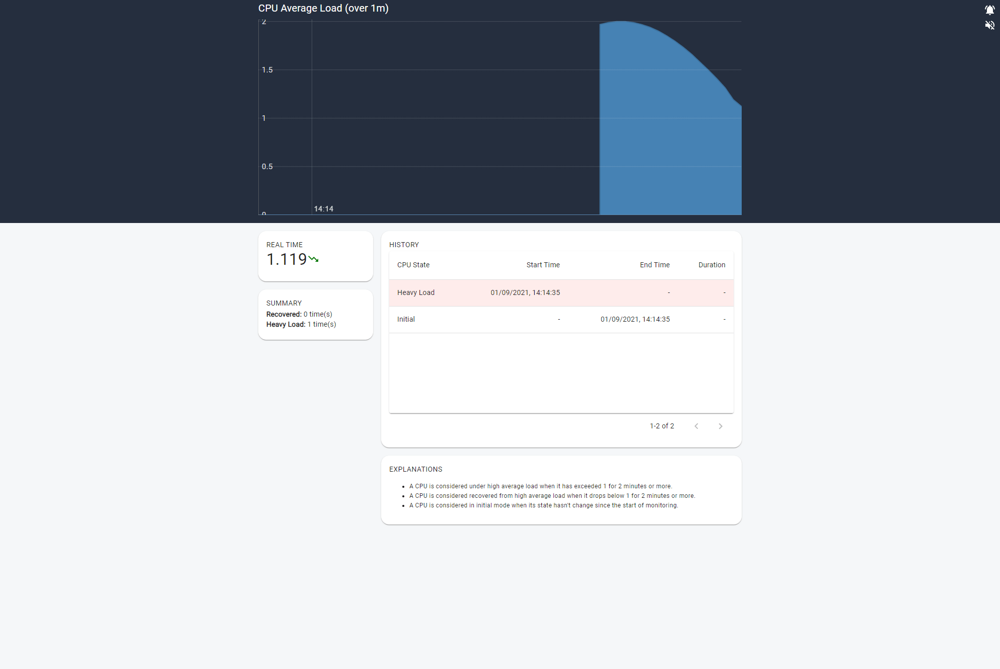
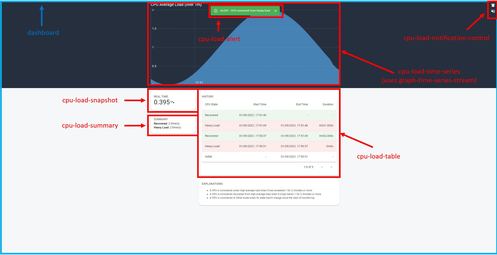
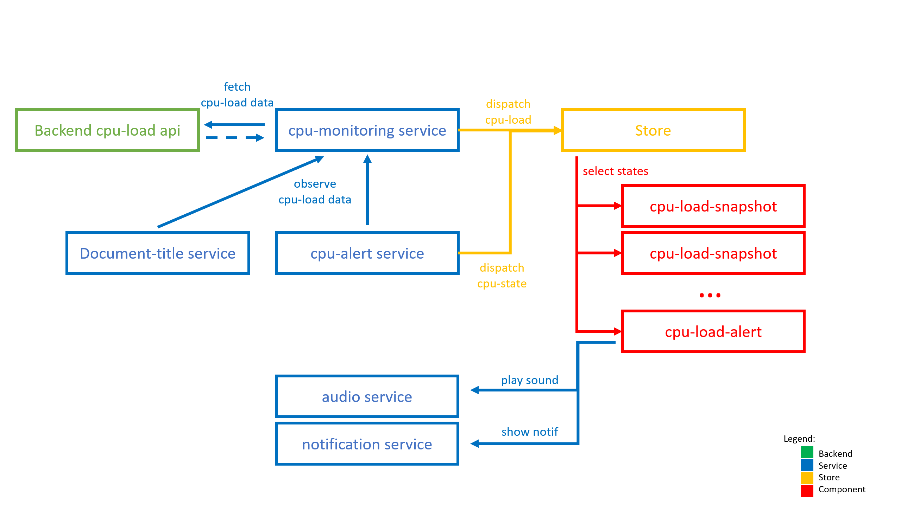

# Monitoring CPU

This application is a proof-of-concept (POC) for a browser-based CPU load monitoring application.

With this application, you have a real-time monitoring of your local CPU Average load.

When CPU is under high average load for more than 2 minutes or when the CPU comes back to normal (recovered state), visual and sound alerts are raised to inform the user.

Alerts activation is managed by the user.

<p align="center">
  
</p>

## Features

- Display time series CPU Average load on a 10s period with a 10 minute window
- Display current CPU average load and trend
- Store history of Heavy & Recovered CPU periods
- Visual and Sound alerts when CPU average load is changing from 'heavy' to 'recovery'

Learn more about CPU load here on [Wikipedia](https://en.wikipedia.org/wiki/Load_%28computing%29)

## Product requirements

- Recommended resolution: > 1024px Width & >1180px height
- Browser support: Last N-1 and N versions for Chrome, Edge, Firefox and Safari
- OS Support: Windows, Linux, MacOS

## Architecture

Project structure:

```text
.
├── apps
│   ├── backend
│   └── frontend
└── packages
    ├── api-client
    └── openapi
```

The application is splitted in 2 apps and 2 packages:

- A [Backend](./apps/backend) in NodeJs & Typescript: in charge to collect the CPU information on the node it is running and deploy HTTP REST API to make this information public
- A [Frontend](./apps/frontend) web application written with React + Redux & Typescript, in charge to regularly collect the CPU information from the local Backend node and display this information to user
- A REST API interface, documented was an [OpenApi specification](./packages/openapi/monitoring-api.yml)
- An Axios & Typescript [Client API project](./packages/api-client) generated using an OpenApi code generator from the OpenApi specification. This project generates Typescript interfaces and client api for both the backend and frontend.

Let's focus only on the frontend design, below the file structure:

```text
. src
├── index.tsx                             - Default application entry point (store creation, services setup)
├── App.tsx                               - Main application component
├── components
│   ├── cpu-load-alert                    - Display alert (visual, notification and sound)
│   ├── cpu-load-notification-control     - Display controls to configure the app
│   ├── cpu-load-notification-snapshot    - Display latest CPU load value
│   ├── cpu-load-summary                  - Display summary of CPU Phases
│   ├── cpu-load-table                    - Display table containing all CPU Phases
│   ├── cpu-load-time-series              - Display CPU average Load in a time series graph
│   ├── dashboard                         - Dashboard organizing components in page
│   └── graph-time-series-stream          - Reusable component for time series graph
├── environment
│   └── environement.ts                   - Configuration of the app
├── hooks
│   └── useObservable                     - React hook for observable
├── services
│   ├── audio.service.ts                  - Service to play audio file
│   ├── cpu-alert.service.ts              - Service to analyse load data and broadcast CPU state
│   ├── cpu-monitoring.service.ts         - Service to get CPU load data from backend at regular interval and error handling
│   ├── document-title.service.ts         - Service to update the web page title
│   └── notification.service.ts           - Service to trigger browser native notification
├── store
│   ├── config                            - Configuration State/Reducer/Selectors/Actions
│   ├── cpu-load                          - Cpu-load State/Reducer/Selectors/Actions
│   ├── hooks.ts                          - Redux hooks for React
│   ├── index.ts                          - Root store definition
│   └── localstorage-persistence.ts       - Utility to backup store data into local storage
├── themes\defaut
│   └── default.theme.ts                  - Application Default Theme
└── utils
    ├── axios-as-observable.tsx           - Utility to convert an axios promise into observable
    └── test-utils.tsx                    - Utility for testing
```

#### Components integration in the application

[](./docs/archi-frontend.png)

#### Component/Services/Store interactions in the application

The backbone of the application is made of Redux store and Services.

Redux store helps to have a single place to store the whole application state so everycomponent can easilly get the application state and be updated on store changes.

Services provide the main business logic (calling the api at regular interval, analysing data to trigger updates etc...).

Services and store are connected in the main application script (index.tsx).

[](./docs/archi-frontend-internal.png)

## Prerequisites

In order to run this application, please make sure your environment is setup with:

- [NodeJS 14](https://nodejs.org/en/)
- [Yarn 2.0](https://yarnpkg.com/getting-started/install)

## Installation

First you must make sure to have executed the following commands in order at least once in order to prepare the project.

```sh
yarn install
yarn build
```

## Usage

To start the app for a developer environement (with automatic watch of the files and reload on change)

```sh
yarn start:dev
```

To start the app for a 'production-like' environement

```sh
yarn start
```

PS: In dev mode, you can simulate an alert by executing the following script in the browser console: `window.heavy= !!!window.heavy; window.simulateAlert(window.heavy, 21*1000);`

## Test

```sh
yarn test
```

## Roadmap for Production

This PoC is not fully qualified to be run in a production environement yet. Here is a list of items to review/implement:

- **Performance-MemoryLeaks**: If this application is intended to monitor a CPU average continuously (24/24h) then both the backend and frontend have to tested about memory leaks on a long period. It might also be a good to implement an automatic and regular restart of backend with sh script, and automatical reload of the frontend page (To be noted, today the frontend doesn't retain the previous data after a refresh, this would be required for this implementation).
- **Performance-Stability**: A process watcher should be put in place to make sure the backend automatically restart after a crash.
- **Design**: The PoC design should be reviewed by a UX team
- **Stability**: Fix all the known bugs (ref section below)
- **Test**: Coverage is not satisfying yet, for a production release it's recommended to improve the coverage rate.
- **Test**: E2E testing scenarios are missing and should be implemented, there is only unit testing of components.
- **Security**: The monitoring data can be a sensible information depending on the business case, that is why security aspects should be considered and reviewed. For instance have a authentication service to access the backend API, opening the port to the loopback address only etc... Also for the frontend part it is usually recommended to implement Content-Security-Policy (CSP) to proctect the web application against malicious scripting or attacks (eg: a library like [helmet](https://helmetjs.github.io/))
- **Configuration**: The PoC contains a very limited capability of user customization (ref frontend redux config store). Some other configuration are "hardcoded" (like refresh period and time window) in [environement.ts](apps\frontend\src\environement\environement.ts) and thus it might be interesing to propose this configuration to the user (To be reviewed with Business teams).
- **Maintenance capability**: In order to ease the maintenance, it would be great to propose a feature to report the logs automatically (eg: [Datadog logs](https://docs.datadoghq.com/fr/logs/)) or manually (with a local dump of logs that user can attach to maintenance ticket).

## Features propositions

Below a list of feature propsals for the business team:

- **I18N**: Localized application to support multiple languages and locales
- **UX**: Display the periods in the time series chart with different colors
- **UX**: Selection of CPU period and highlight the period in the time series chart
- **Processes**: It could be interesting to propose more information to the user, for instance to have a details of the processes being executed by the CPU, like [top](https://man7.org/linux/man-pages/man1/top.1.html)

## Known bugs

- **Material-ui | findDOMNode deprecated**: When the first alert is shown to user, there is a warning "findDOMNode is deprecated in StrictMode" coming from the use of Snackbar component, however the issue is known and will be fixed by the community soon in material-ui v5 [#13394](https://github.com/mui-org/material-ui/issues/13394). A library update should be done before a load in production, despite the current warning is not a blocker.
- **rickshaw-lib | production build mangle issue**: I discovered at the late stage of the developement that the frontend application doesn't start from a production build. After investigating and debugging the library codebase I figured out there is a mangle issue in at runtime in [Rickshaw.Graph.Renderer.Line.js#L9](https://github.com/shutterstock/rickshaw/blob/10ed07db7fa03a3667a276d55514c999e8c9ab72/src/js/Rickshaw.Graph.Renderer.Line.js#L9) due to this piece of code in [Rickshaw.Class.js#L175](https://github.com/shutterstock/rickshaw/blob/10ed07db7fa03a3667a276d55514c999e8c9ab72/src/js/Rickshaw.Class.js#L175). This issue is known by the community and reported here (issue #52)[https://github.com/shutterstock/rickshaw/issues/52]. For this PoC I created a "hack" (ref [config-overrides.js](./apps/frontend/config-overrides.js) file), there are 2 possibilities to solve it: First is to raise a PR for the open source project and wait its integration, Second is to replace the library with an other.

## LICENSE

[MIT](./LICENSE.md)
